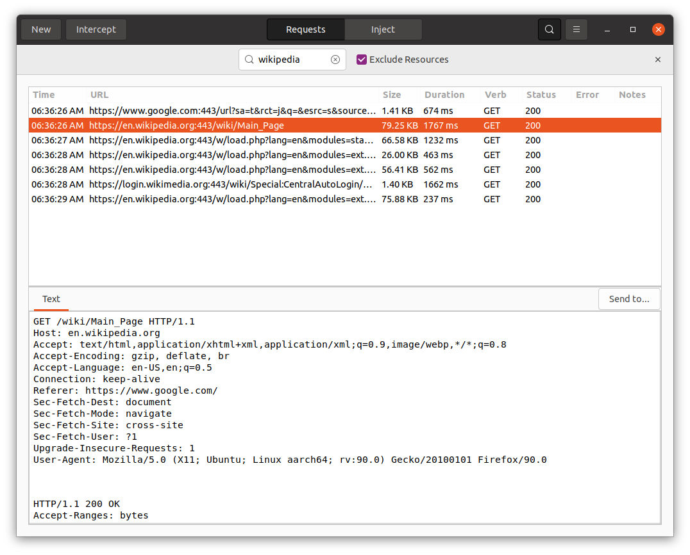

## Overview
Proximity is an intercepting proxy, allowing you to view and manipulate network requests between your web browser and the servers its communicating with. It is designed for web application penetration testing, but could be used for general debugging of applications, etc. It is similar in principle to mitmproxy or OWASP ZAP.

It takes the philosophy of do one thing, and do it well. The intent is not to pack in features which are rarely, if ever, used in practice. This is especially true where good quality standalone tools already exist.

This repository contains the GTK (Linux) user interface which proxies traffic. It interacts with the core which provides the core functionality and is available at [https://github.com/pipeline/proximity-core/](https://github.com/pipeline/proximity-core/).



One of the reasons for developing this is to give back to the community. I want to help people who are new to pentesting, while still having 99% of what experienced pentesters need day to day.

Given this is still under development, bugs should be expected, although any feedback is greatly appreciated.

Please only use this against applications that you have permission to test.

## Installation
Download from the latest release from [https://github.com/pipeline/proximity-frontend-gtk/releases](https://github.com/pipeline/proximity-frontend-gtk/releases)

As the project grows, it will be published to repositories, for now, it is available as a downloadable Flatpak bundle. To install it, you'll first need Flatpak, if you don't have it already:
```
sudo apt install flatpak libpam-gnome-keyring
```
If these needed to be installed, it may be safest to reboot your system twice to ensure the correct environment variables are set and the login keychain is created/unlocked.

You'll need the Flatpak platform it's based on:
```
flatpak remote-add --if-not-exists flathub https://flathub.org/repo/flathub.flatpakrepo
```

Then you can install Proximity (you can download the latest version from the releases directory):
```
flatpak install Proximity.flatpak
```

To run, from a console type:
```
flatpak run com.forensant.proximity
```

To run this on Windows Subsystem for Linux (Windows 11), you'll need a headless keyring: https://github.com/jaraco/keyring#using-keyring-on-headless-linux-systems

## Development/build instructions

### Dependencies
You'll require the following dependencies to develop Proximity:
 * Meson build system
 * GTK3+
 * C compiler/Vala
 * libsoup
 * libjson-glib
 * libwebkit2-gtk
 * libgtksourceview-3
 * libnotify

On Debian based distributions, these can be downloaded with:
 ```sudo apt install build-essential valac meson libgtk-3-dev libsoup2.4-dev libjson-glib-dev libwebkit2gtk-4.0-dev libgtksourceview-3.0-dev libgee-0.8-dev libnotify-dev```

If you're going to be building/packaging Proximity, you'll also require the Flatpak dependencies:
```
flatpak install org.gnome.Sdk
flatpak install org.gnome.Platform
```

Select version 42

### Building
Setup the build directory with ```meson setup builddir``` then run ```ninja -C builddir``` to start the build.

To run, you'll require Proximity Core in the same directory [https://github.com/pipeline/proximity-core/](https://github.com/pipeline/proximity-core/)

 ## Running
 A basic run can be launched with:
 ```GSETTINGS_SCHEMA_DIR=src/ ./com.forensant.proximity```

To build and run:
 ```ninja -C builddir && GSETTINGS_SCHEMA_DIR=builddir/src/ builddir/com.forensant.proximity```

To build/run with Flatpak:
```
flatpak-builder --force-clean --user --install build-dir com.forensant.proximity.yml
flatpak run com.forensant.proximity
```

To build the bundle:
```
flatpak-builder --repo=repo --force-clean build-dir com.forensant.proximity.yml
flatpak build-bundle repo proximity.flatpak com.forensant.proximity
```
Note that if you're testing a built bundle, you may have multiple instances installed on your system.

## 🤝 Contributing

Contributions, issues and feature requests are welcome.<br />
Feel free to check [issues page](https://github.com/pipeline/proximity-frontend-gtk/issues) if you want to contribute.<br />
[Check the contributing guide](./CONTRIBUTING.md).<br />

While this codebase will remain free and open source, there will be commercial frontends built on top in the future with further features which are designed to help professional pentesters.

## Licence
This project is MIT licensed.
